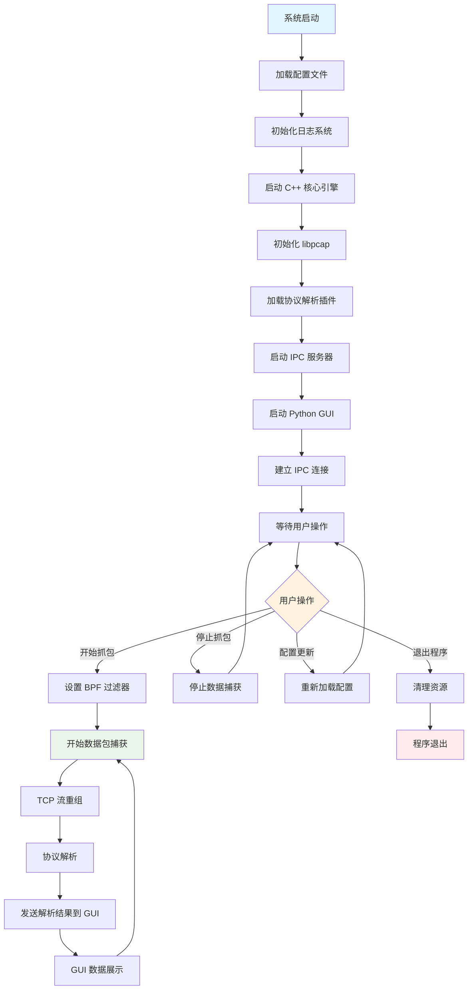

# 系统总体流程图

## 描述
此流程图展示了 ProtoParse 系统从启动到运行的完整生命周期，包括初始化、用户交互和数据处理的主要流程。

## 流程图

## 关键节点说明

1. **系统启动阶段**：
   - 加载 YAML 配置文件
   - 初始化日志系统（spdlog）
   - 启动 C++ 核心引擎

2. **初始化阶段**：
   - 初始化 libpcap 库
   - 动态加载协议解析插件
   - 启动 Unix Domain Socket 服务器

3. **GUI 连接阶段**：
   - 启动 PySide2 图形界面
   - 建立 IPC 通信连接
   - 进入用户交互循环

4. **运行阶段**：
   - 响应用户操作（开始/停止抓包、配置更新等）
   - 实时数据处理循环
   - 数据展示和可视化

5. **退出阶段**：
   - 清理系统资源
   - 关闭网络接口
   - 程序正常退出
