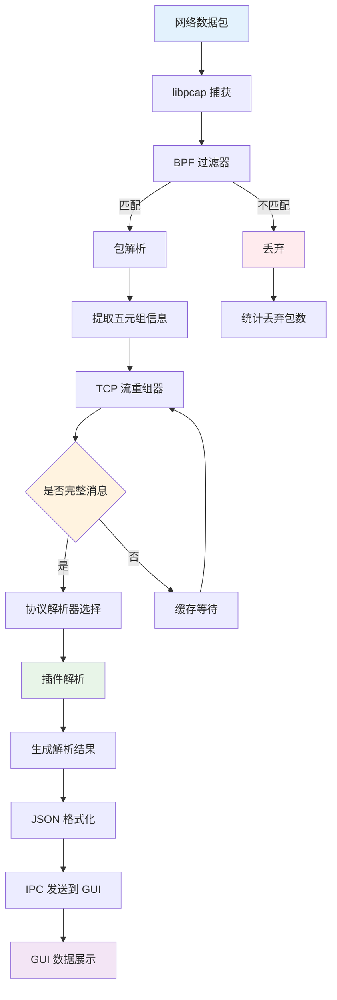

# 数据包处理流程图

## 描述
此流程图详细展示了从网络数据包捕获到协议解析的完整数据处理pipeline，包括过滤、重组、解析和输出的各个环节。

## 流程图

## 详细说明

### 1. 数据包捕获阶段
- **网络数据包**：从网络接口接收的原始数据包
- **libpcap 捕获**：使用 libpcap 库进行底层包捕获
- **BPF 过滤器**：基于 Berkeley Packet Filter 进行高效过滤

### 2. 包解析阶段
- **包解析**：解析以太网帧、IP 头、TCP 头等
- **五元组提取**：提取源IP、目标IP、源端口、目标端口、协议类型
- **过滤匹配**：根据配置的过滤规则决定是否处理

### 3. TCP 流重组阶段
- **TCP 流重组器**：将分片的 TCP 包重组为完整的应用层数据流
- **完整性检查**：判断是否收到完整的应用层消息
- **缓存机制**：对不完整的数据进行缓存等待

### 4. 协议解析阶段
- **解析器选择**：根据端口号和协议特征选择合适的解析插件
- **插件解析**：调用对应的协议解析插件进行数据解析
- **结果生成**：生成结构化的解析结果

### 5. 数据输出阶段
- **JSON 格式化**：将解析结果转换为 JSON 格式
- **IPC 通信**：通过 Unix Domain Socket 发送到 GUI
- **数据展示**：在图形界面中展示解析结果

## 性能优化点

1. **零拷贝机制**：libpcap 支持零拷贝，减少内存拷贝开销
2. **环形缓冲区**：使用环形缓冲区提高数据处理效率
3. **异步处理**：TCP 重组和协议解析采用异步处理模式
4. **内存池**：使用内存池减少频繁的内存分配和释放
