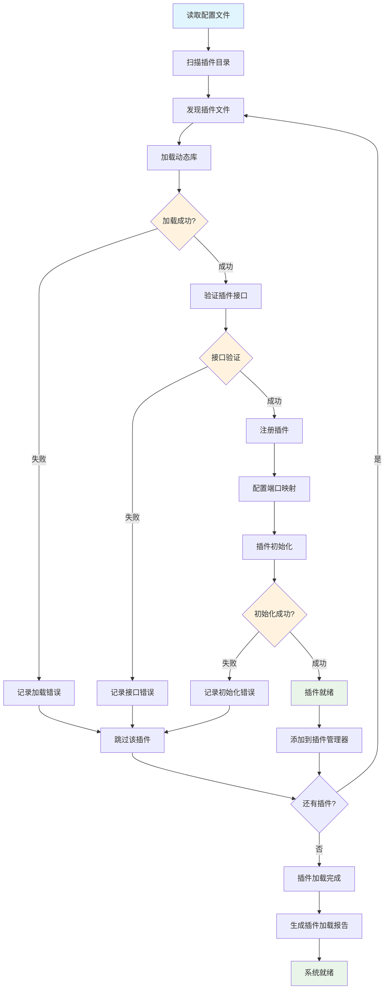

# 插件加载流程图

## 描述
此流程图展示了协议解析插件的动态加载过程，包括插件发现、验证、注册和初始化的完整流程。

## 流程图

## 详细说明

### 1. 配置读取阶段
- **读取配置文件**：解析 `capture_config.yaml` 中的插件配置
- **扫描插件目录**：遍历指定目录查找 `.so` 或 `.dll` 文件
- **发现插件文件**：根据文件扩展名和命名规则识别插件

### 2. 动态库加载阶段
- **加载动态库**：使用 `dlopen()` (Linux/macOS) 或 `LoadLibrary()` (Windows)
- **符号解析**：查找必需的导出函数（CreateParser、DestroyParser等）
- **错误处理**：记录加载失败的插件及原因

### 3. 接口验证阶段
- **接口验证**：检查插件是否实现了 `IProtocolParser` 接口
- **版本兼容性**：验证插件版本与核心程序的兼容性
- **依赖检查**：确认插件所需的依赖库是否可用

### 4. 插件注册阶段
- **注册插件**：将验证通过的插件注册到插件管理器
- **端口映射**：根据配置建立端口号到插件的映射关系
- **优先级设置**：为插件设置解析优先级

### 5. 初始化阶段
- **插件初始化**：调用插件的初始化函数
- **资源分配**：为插件分配必要的内存和资源
- **状态设置**：将插件状态设置为就绪

### 6. 完成阶段
- **插件管理器更新**：将就绪的插件添加到管理器中
- **加载报告**：生成插件加载的详细报告
- **系统就绪**：所有插件加载完成，系统准备就绪

## 错误处理机制

1. **加载错误**：动态库文件不存在或损坏
2. **接口错误**：插件未实现必需的接口函数
3. **初始化错误**：插件初始化过程中发生异常
4. **版本冲突**：插件版本与核心程序不兼容

## 插件热加载支持

系统支持运行时热加载插件：
- 监控插件目录变化
- 动态卸载旧版本插件
- 加载新版本插件
- 更新端口映射关系
