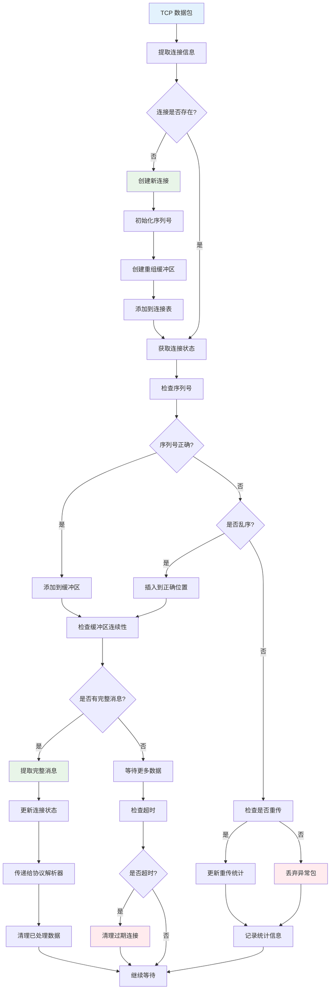

# TCP 流重组流程图

## 描述
此流程图详细展示了 TCP 数据包重组的过程，包括连接跟踪、序列号处理、乱序重组和完整性检查。

## 流程图

## 详细说明

### 1. 连接管理
- **连接识别**：基于五元组（源IP、目标IP、源端口、目标端口、协议）
- **连接状态**：跟踪 TCP 连接的建立、数据传输、关闭状态
- **连接表**：维护活跃连接的哈希表，支持快速查找

### 2. 序列号处理
- **初始序列号**：记录连接建立时的初始序列号
- **相对序列号**：转换为相对序列号便于处理
- **序列号验证**：检查接收到的序列号是否在有效窗口内

### 3. 乱序处理
- **乱序检测**：比较接收序列号与期望序列号
- **插入排序**：将乱序包插入到缓冲区的正确位置
- **连续性检查**：检查缓冲区中是否形成连续的数据流

### 4. 重传处理
- **重传检测**：识别重复的序列号范围
- **重传统计**：记录重传包的数量和频率
- **去重处理**：避免重复数据影响解析结果

### 5. 完整性检查
- **消息边界**：根据协议特征确定消息的完整性
- **缓冲区管理**：动态调整缓冲区大小
- **内存控制**：防止缓冲区无限增长

### 6. 超时处理
- **连接超时**：清理长时间无活动的连接
- **数据超时**：处理长时间未完成重组的数据
- **资源回收**：及时释放不再需要的内存资源

## 性能优化

1. **哈希表优化**：使用高效的哈希算法加速连接查找
2. **内存池**：预分配内存池减少动态分配开销
3. **批量处理**：批量处理多个数据包提高效率
4. **并行重组**：对不同连接的数据并行处理
