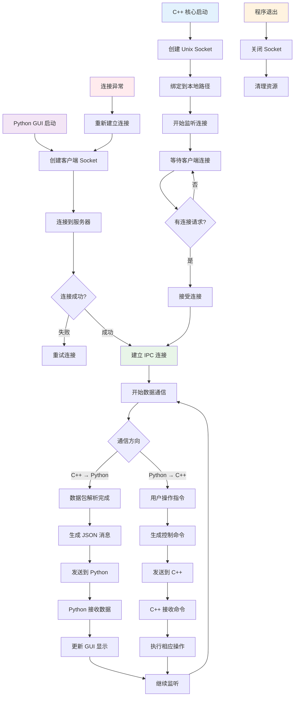

# IPC 通信流程图

## 描述
此流程图展示了 C++ 核心引擎与 Python GUI 之间通过 Unix Domain Socket 进行进程间通信的详细流程。

## 流程图



## 详细说明

### 1. 服务器端（C++ 核心）
- **Socket 创建**：创建 Unix Domain Socket 服务器
- **路径绑定**：绑定到 `/tmp/protoparse.sock` 路径
- **监听连接**：等待客户端连接请求
- **连接管理**：支持多个客户端同时连接

### 2. 客户端（Python GUI）
- **Socket 连接**：创建客户端 Socket 并连接到服务器
- **重连机制**：连接失败时自动重试
- **心跳检测**：定期发送心跳包检测连接状态

### 3. 数据通信协议
- **消息格式**：使用 JSON 格式进行数据交换
- **消息头**：包含消息类型、长度等元信息
- **消息体**：具体的数据内容

### 4. 双向通信
**C++ → Python（数据推送）**：
- 解析完成的协议数据
- 系统状态更新
- 错误和警告信息

**Python → C++（控制命令）**：
- 开始/停止抓包指令
- 配置更新命令
- 插件管理操作

### 5. 异常处理
- **连接断开**：自动重连机制
- **消息丢失**：消息确认和重传
- **缓冲区溢出**：流量控制机制

## 消息类型定义

### 数据消息（C++ → Python）
```json
{
    "type": "packet_data",
    "timestamp": "2025-01-31T11:19:31Z",
    "connection": {...},
    "parsed_data": {...}
}
```

### 控制消息（Python → C++）
```json
{
    "type": "control",
    "action": "start_capture",
    "params": {...}
}
```

### 状态消息（双向）
```json
{
    "type": "status",
    "component": "core_engine",
    "status": "running",
    "details": {...}
}
```
