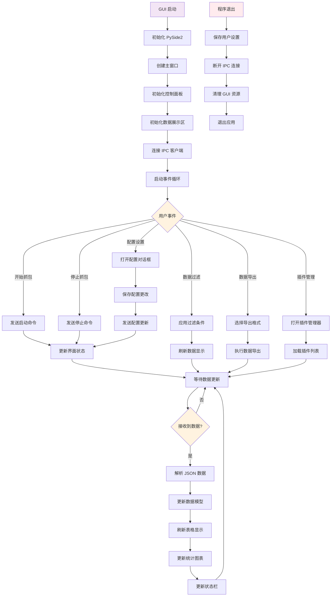

# GUI 工作流程图

## 描述
此流程图展示了 Python GUI 的用户交互工作流程，包括界面初始化、用户操作处理和数据展示更新。

## 流程图

## 详细说明

### 1. 初始化阶段
- **PySide2 初始化**：设置 Qt 应用程序环境
- **主窗口创建**：创建主窗口和菜单栏
- **组件初始化**：初始化各个 UI 组件
- **IPC 连接**：建立与 C++ 核心的通信连接

### 2. 用户交互处理
- **抓包控制**：开始/停止抓包操作
- **配置管理**：修改系统配置参数
- **数据操作**：过滤、搜索、导出数据
- **插件管理**：启用/禁用协议解析插件

### 3. 数据展示更新
- **实时更新**：接收来自 C++ 核心的数据推送
- **数据模型**：使用 Qt 的 Model/View 架构
- **表格显示**：展示数据包列表和解析结果
- **图表可视化**：统计图表和趋势分析

### 4. 配置管理
- **用户设置**：保存用户的界面偏好设置
- **配置同步**：与 C++ 核心同步配置更改
- **配置验证**：验证配置参数的有效性

## GUI 组件说明

### 主要组件
1. **控制面板**：抓包控制、配置设置
2. **数据表格**：数据包列表显示
3. **详情面板**：协议解析结果详情
4. **统计图表**：流量统计和趋势图
5. **状态栏**：系统状态和统计信息

### 对话框
1. **配置对话框**：系统参数配置
2. **插件管理器**：插件启用/禁用管理
3. **导出对话框**：数据导出选项设置
4. **关于对话框**：软件版本和帮助信息
