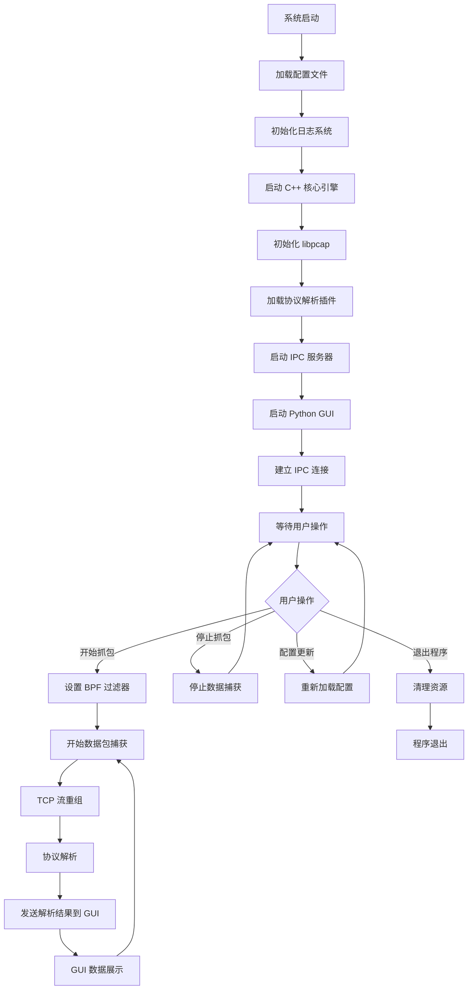
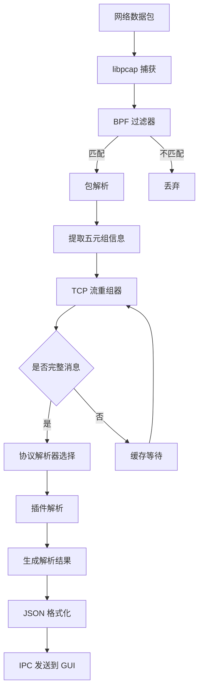
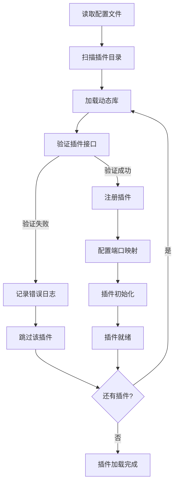

# ProtoParse 详细设计文档

## 1. 文档目的及范围

### 1.1 文档目的
本文件描述了 ProtoParse TCP 协议抓包与解析工具的程序详细设计，帮助软件研发人员快速、有效、规范地进行此程序的开发。

### 1.2 适用范围
本文档适用于 ProtoParse 项目的开发、测试、部署和维护工作。

### 1.3 预期读者
- 软件工程师
- 系统架构师
- 测试工程师
- 运维工程师

### 1.4 项目概述
ProtoParse 是一个专为内部 TCP 协议设计的高性能抓包与解析工具。采用 C++ 核心 + Python GUI 的混合架构，在保证性能的同时提供灵活的协议解析能力和友好的用户界面。

## 2. 开发环境

### 2.1 操作系统
- **主要平台**：Linux (Ubuntu 18.04+, CentOS 7+)
- **支持平台**：macOS (10.14+), Windows (10+)

### 2.2 编程语言
- **核心引擎**：C++ (C++17 标准)
- **用户界面**：Python 3.8+

### 2.3 编译器
- **Linux**：GCC 8.0+ 或 Clang 10.0+
- **macOS**：Xcode 11.0+ (Clang)
- **Windows**：Visual Studio 2019+ 或 MinGW-w64

### 2.4 开发工具
- **构建系统**：CMake 3.12+
- **版本控制**：Git
- **IDE 推荐**：Visual Studio Code, CLion, Qt Creator
- **Python 环境**：建议使用虚拟环境 (venv 或 conda)

## 3. 运行环境

### 3.1 硬件要求
- **CPU**：1GHz 以上多核处理器
- **内存**：512MB 以上（推荐 2GB+）
- **硬盘**：可用空间 1GB 以上
- **网络**：至少 1 个网络接口（推荐 2 个 100M+ 以太网卡）

### 3.2 操作系统
- **Linux**：Ubuntu 18.04+, CentOS 7+, RHEL 7+
- **macOS**：10.14+
- **Windows**：Windows 10+

### 3.3 系统权限
- **Linux/macOS**：需要 root 权限或 CAP_NET_RAW 能力
- **Windows**：需要管理员权限

### 3.4 网络环境
- 支持混杂模式的网络接口
- 网络流量不超过接口带宽的 80%（避免丢包）

## 4. 技术选型

### 4.1 架构选择：C++ + Python 混合方案

经过对比分析，最终选择 C++ 核心 + Python GUI 的混合架构，原因如下：

#### 为什么不采用单一语言方案？

**纯 C++ 方案的问题：**
- 开发效率低：用 C++ 编写和调试协议解析器耗时较长
- 插件开发复杂：需要处理动态库加载、内存管理等底层细节
- GUI 开发成本高：虽然 Qt/C++ 功能强大，但开发周期长
- 安全风险：插件中的内存错误会导致整个程序崩溃

**纯 Python 方案的问题：**
- 性能瓶颈：Python 的 GIL 和解释执行特性无法满足高吞吐量抓包需求
- 实时性差：在高流量场景下容易出现丢包现象
- 系统调用开销：频繁的系统调用会影响抓包性能

**纯 Go 方案的问题：**
- 插件系统限制：Go 的 plugin 包仅支持 Linux，跨平台性差
- GUI 生态不成熟：相比 Qt，Go 的 GUI 框架选择有限

#### 混合架构的优势

**性能与灵活性并重：**
- C++ 核心处理性能敏感的抓包和 TCP 重组任务
- Python 负责灵活的协议解析和用户界面开发
- 进程隔离保证了系统的稳定性和安全性

**开发效率最优：**
- 协议解析插件用 Python 开发，迭代速度快
- GUI 界面开发效率高，Qt 生态丰富
- 各模块职责清晰，便于团队协作

### 4.2 核心技术栈

| 组件 | 技术选择 | 选择理由 |
|------|----------|----------|
| **抓包核心** | C++ + libpcap | 业界标准，跨平台，性能卓越 |
| **GUI 界面** | Python + PySide2 | 开发效率高，Qt 生态成熟 |
| **进程通信** | Unix Domain Socket | 高性能本地 IPC，支持双向通信 |
| **数据格式** | JSON | 简单易解析，便于调试和扩展 |
| **构建系统** | CMake (C++) + pip (Python) | 跨平台支持，依赖管理完善 |

### 4.3 libpcap 选择说明

**为什么选择 libpcap？**

1. **跨平台兼容性**：
   - Linux：原生支持，性能最优
   - macOS：系统内置，无需额外安装
   - Windows：通过 Npcap 提供兼容支持

2. **成熟稳定**：
   - 20+ 年的发展历史，久经考验
   - 被 tcpdump、Wireshark 等知名工具广泛使用
   - 社区活跃，文档完善

3. **功能完备**：
   - 支持 BPF (Berkeley Packet Filter) 语法进行高效过滤
   - 提供零拷贝机制，减少内存开销
   - 支持多种网络接口类型

4. **性能优势**：
   - 内核级过滤，减少用户态数据拷贝
   - 支持环形缓冲区，提高数据处理效率
   - 可配置的缓冲区大小和超时参数

**与其他方案对比：**

| 方案 | 优势 | 劣势 | 适用场景 |
|------|------|------|----------|
| **libpcap** | 跨平台、成熟、功能全 | 需要管理员权限 | 通用抓包工具 |
| **Raw Socket** | 控制精细 | 平台相关性强、权限要求高 | 特定协议分析 |
| **eBPF** | 性能极佳 | 仅限 Linux、学习成本高 | 高性能场景 |
| **DPDK** | 极致性能 | 复杂度极高、硬件要求严格 | 专业网络设备 |

### 4.4 第三方库依赖

**C++ 核心依赖：**
- `libpcap` - 网络包捕获
- `nlohmann/json` - JSON 处理
- `spdlog` - 日志记录
- `yaml-cpp` - 配置文件解析

**Python GUI 依赖：**
- `PySide2` - Qt 界面框架
- `pyqtgraph` - 高性能图表绘制
- `pyyaml` - 配置文件处理

## 5. 功能说明

### 5.1 功能描述

#### 5.1.1 核心功能
1. **网络数据包捕获**
   - 支持多种网络接口类型（以太网、无线、环回等）
   - 基于 BPF 过滤器的高效包过滤
   - 支持混杂模式和非混杂模式
   - 实时捕获和离线文件分析

2. **TCP 流重组**
   - 自动重组 TCP 分片数据包
   - 处理乱序、重传、丢包等异常情况
   - 维护连接状态和会话信息
   - 支持双向数据流分析

3. **协议解析**
   - 插件化的协议解析框架
   - 支持自定义内部协议
   - 消息分帧和结构化解析
   - 协议版本兼容性管理

4. **数据展示**
   - 实时数据包列表显示
   - 协议解析结果可视化
   - 统计图表和趋势分析
   - 数据过滤和搜索功能

#### 5.1.2 辅助功能
1. **配置管理**
   - 简单的 INI 配置文件
   - 运行时配置热更新
   - 多环境配置支持

2. **日志记录**
   - 分级日志输出
   - 日志轮转和归档
   - 性能监控和调试信息

3. **数据导出**
   - 支持多种格式导出（JSON、CSV、PCAP）
   - 批量数据处理
   - 报告生成功能

### 5.2 输入输出

#### 5.2.1 输入
1. **网络数据流**
   - 实时网络接口数据
   - PCAP/PCAPNG 格式文件
   - 指定端口和协议的过滤条件

2. **配置参数**
   - 抓包接口和过滤规则
   - 协议解析插件配置
   - 系统运行参数

3. **用户交互**
   - GUI 界面操作指令
   - 命令行参数
   - 配置文件修改

#### 5.2.2 输出
1. **实时数据**
   - 解析后的协议数据结构
   - 连接状态和统计信息
   - 异常和错误报告

2. **可视化展示**
   - 数据包列表和详情
   - 协议字段解析结果
   - 统计图表和趋势图

3. **导出文件**
   - 结构化数据文件（JSON、XML）
   - 表格数据（CSV、Excel）
   - 原始包文件（PCAP）

## 6. 系统架构

### 6.1 整体架构图

```
┌─────────────────────────────────────┐
│           PySide2 GUI               │
│  ┌─────────────┐ ┌─────────────────┐ │
│  │ 主控制面板   │ │   数据展示区     │ │
│  │ • 启动/停止  │ │ • 包列表        │ │
│  │ • 过滤配置  │ │ • 协议解析结果   │ │
│  │ • 插件管理  │ │ • 统计图表      │ │
│  └─────────────┘ └─────────────────┘ │
└─────────────┬───────────────────────┘
              │ Unix Domain Socket
              │ (JSON 消息)
┌─────────────▼───────────────────────┐
│           C++ 核心引擎               │
│  ┌─────────────┐ ┌─────────────────┐ │
│  │ 抓包模块     │ │   协议解析器     │ │
│  │ • libpcap   │ │ • 插件管理器     │ │
│  │ • 包过滤    │ │ • TCP 流重组    │ │
│  │ • 流重组    │ │ • 消息分帧      │ │
│  └─────────────┘ └─────────────────┘ │
└─────────────────────────────────────┘
```

### 6.2 模块职责

#### 6.2.1 C++ 核心引擎
- **抓包模块**：使用 libpcap 进行网络包捕获，支持 BPF 过滤
- **TCP 流重组**：将分片的 TCP 包重组为完整的应用层数据流
- **协议解析器**：插件化的协议解析框架
- **通信服务**：通过 Unix Socket 与 GUI 进行数据交换

#### 6.2.2 Python GUI
- **主控制面板**：抓包启停、配置管理、插件加载
- **数据展示**：实时显示抓包结果和解析数据
- **可视化**：协议统计图表、流量趋势分析
- **交互控制**：过滤器设置、数据导出等

## 7. 流程设计

### 7.1 总体流程



### 7.2 数据包处理流程



### 7.3 插件加载流程



## 8. 详细设计

### 8.1 核心接口设计

#### 8.1.1 协议解析器接口

```cpp
// core/include/protocol/parser_interface.h
class IProtocolParser {
public:
    virtual ~IProtocolParser() = default;
    
    // 判断是否能解析此数据流
    virtual bool CanParse(const ConnectionInfo& conn, 
                          const uint8_t* data, 
                          size_t length) = 0;
    
    // 解析数据流
    virtual std::vector<ParsedMessage> Parse(const uint8_t* data, 
                                           size_t length) = 0;
    
    // 获取解析器信息
    virtual std::string GetName() const = 0;
    virtual std::string GetVersion() const = 0;
};
```

#### 8.1.2 IPC 通信协议

**C++ → Python 消息格式：**
```json
{
    "type": "packet_data",
    "timestamp": "2025-01-31T10:27:49Z",
    "connection": {
        "src_ip": "192.168.1.100",
        "dst_ip": "192.168.1.200",
        "src_port": 8080,
        "dst_port": 12345,
        "protocol": "TCP"
    },
    "parser": "custom_protocol_v1",
    "messages": [
        {
            "id": 1,
            "type": "request",
            "length": 256,
            "data": {...}
        }
    ]
}
```

**Python → C++ 控制命令：**
```json
{
    "type": "control",
    "action": "start_capture",
    "params": {
        "interface": "eth0",
        "filter": "tcp port 8080",
        "plugins": ["custom_protocol_v1"]
    }
}
```

### 8.2 插件开发框架

#### 8.2.1 插件接口
插件需要实现 `IProtocolParser` 接口，并提供以下导出函数：

```cpp
extern "C" {
    // 创建解析器实例
    IProtocolParser* CreateParser();
    
    // 销毁解析器实例
    void DestroyParser(IProtocolParser* parser);
    
    // 获取插件信息
    const char* GetPluginInfo();
}
```

#### 8.2.2 配置文件格式

```yaml
# core/config/capture_config.yaml
capture:
  interface: "any"
  buffer_size: 65536
  timeout_ms: 1000

filters:
  - name: "web_traffic"
    expression: "tcp port 80 or tcp port 443"
  - name: "custom_protocol"
    expression: "tcp port 8080"

plugins:
  - name: "custom_protocol_v1"
    library: "./plugins/libcustom_v1.so"
    ports: [8080, 8081]
    enabled: true

logging:
  level: "info"
  file: "logs/protoparse.log"
```

## 9. 开发计划

### 9.1 开发阶段

#### 阶段一：核心框架（2-3 天）
- [ ] 搭建 C++ 项目结构和构建系统
- [ ] 实现基础的 libpcap 抓包功能
- [ ] 实现 TCP 流重组
- [ ] 建立 IPC 通信机制

#### 阶段二：协议解析（2-3 天）
- [ ] 设计并实现协议解析器接口
- [ ] 实现插件加载机制
- [ ] 开发示例协议解析插件
- [ ] 添加配置文件支持

#### 阶段三：GUI 界面（3-4 天）
- [ ] 搭建 PySide2 项目结构
- [ ] 实现主窗口和控制面板
- [ ] 实现数据展示组件
- [ ] 集成图表和可视化

#### 阶段四：集成测试（1-2 天）
- [ ] 端到端功能测试
- [ ] 性能测试和优化
- [ ] 文档完善

### 9.2 技术风险与应对

| 风险 | 影响 | 应对措施 |
|------|------|----------|
| libpcap 权限问题 | 抓包功能无法使用 | 提供详细的权限配置文档 |
| TCP 流重组复杂性 | 数据解析错误 | 使用成熟的重组算法，充分测试 |
| 跨平台兼容性 | 部分平台无法运行 | 使用跨平台库，多平台测试 |
| 性能瓶颈 | 高流量时丢包 | 性能分析，优化热点代码 |

## 10. 部署与运维

### 10.1 系统要求
- **操作系统**：Linux (Ubuntu 18.04+), macOS (10.14+), Windows (10+)
- **编译器**：GCC 8+ / Clang 10+ / MSVC 2019+
- **Python**：3.8+
- **权限**：需要网络抓包权限（Linux 需要 CAP_NET_RAW）

### 10.2 安装部署
详见项目根目录的 `README.md` 和 `scripts/` 目录下的安装脚本。

## 11. 后续扩展

- **协议库**：建立常用内部协议的解析插件库
- **性能优化**：引入 DPDK 或 eBPF 提升抓包性能
- **分布式部署**：支持多节点协同抓包
- **机器学习**：基于流量模式的智能协议识别
- **Web 界面**：提供 Web 版本的管理界面

---

*本文档将随着项目开发进度持续更新。*
